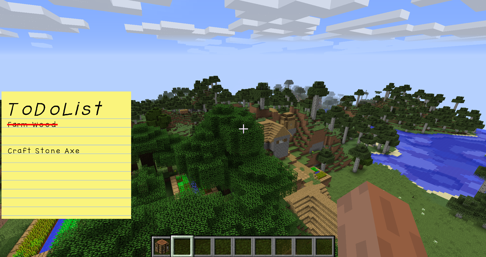
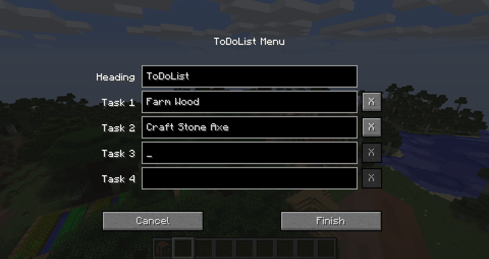

# ToDoList - Minecraft Forge Mod
A Minecraft Forge Mod witch adds a simple ingame ToDoList with up to four tasks. Easy and fast ingame config.
Got the idea from skate702, a German Minecraft Lets player, who uses such a list in his videos.

## Ingame Screenshot

---

## Config Screen

---

## Mod Download
https://www.curseforge.com/minecraft/mc-mods/simple-todolist-overlay

### License
Attribution-NonCommercial 3.0 Unported
